# 🐞 BUG-Busters E2E Test Automation Framework
> **Wipro Capstone Project - Comprehensive Test Automation Solution**

---

## 📌 Project Overview
This repository contains a production-grade, end-to-end (E2E) automation testing framework designed for the e-commerce application [QA Automation Labs shop](https://shop.qaautomationlabs.com/).

Developed collaboratively by **Team BUG-Busters**, this framework integrates **UI testing**, **API testing**, and **Behavior-Driven Development (BDD)** into a single, cohesive, and resilient automation suite.

```mermaid
graph TD
    subgraph UI_Layer [UI Automation Layer]
        A[Gherkin Feature Files] -->|pytest-bdd| B[Step Definitions]
        B --> C[Page Object Model - POM]
        C --> D[Locators Class]
        C --> E[BasePage Utilities]
        E -->|Selenium WebDriver| F[E-Commerce Web AUT]
    end

    subgraph API_Layer [API Automation Layer]
        G[API Test Cases] --> H[Endpoints Classes]
        H --> I[API Base Client]
        I -->|HTTP Sessions + Retry| J[DummyJSON Mock Server]
    end

    subgraph Core [Test Core & Reporting]
        K[conftest.py - Driver & Hook] -->|Screenshot on Failure| L[Allure Reports]
        K -->|Test Metadata| M[Pytest-HTML Report]
        N[pytest.ini - Config] --> K
    end
```



---

## 🎯 Project Scope & Objectives

### Problem Definition
Modern web applications demand flawless user experience (UI) and underlying web services (API) consistency. E-Commerce flows, such as checkout and cart calculations, involve complex state changes that are highly prone to regressions. This project builds a unified framework to validate both UI and API layers in synchronization.

### SMART Goals
* **Automate 80%+** of regression test cases for the target e-commerce platform.
* Maintain a **flakiness rate of <5%** by using explicit synchronization waits and dynamic page load strategies.
* Maintain **100% test run stability** even during transient API failures (using auto-retry backoff handlers).
* Provide full **CI/CD integration** running in headless mode.

### Gaps Identified & Solved
* **Poor UI & API Integration**: Solved by maintaining shared configuration constants and aligning test scenarios.
* **Hardcoded Test Data**: Resolved by leveraging standard python configuration utilities and custom test account pools.
* **Lack of Reusable Steps**: Resolved by designing clean Pytest BDD Gherkin structures mapped to parameterized fixtures.
* **Weak Reporting**: Solved by implementing **Allure Reports** with automatic screenshot-on-failure capture.

---

## 🛠️ Tech Stack & Dependencies

| Category | Tools & Technologies | Description |
|----------|----------------------|-------------|
| **Language** | Python 3.11+ | Core programming language |
| **UI Automation** | Selenium WebDriver | Browser driving engine |
| **BDD Wrapper** | Pytest-BDD | BDD scenario runner utilizing pytest hooks |
| **API Client** | Requests | Lightweight REST client for integration tests |
| **Report Engine** | Allure Reports | Detailed interactive web-based test report |
| **CI/CD** | GitHub Actions | Automated build and verification pipeline |
| **Utilities** | webdriver-manager | Automatically resolves browser/driver versions |

---

## 📂 Framework Directory Structure

```text
BUG-Busters-E2E-Automation-Framework/
│
├── .github/workflows/      # CI/CD configurations (GitHub Actions CI)
│   └── ci.yml
│
├── api/                    # API automation modules
│   ├── Base/               # Session manager with HTTP retries & timeouts
│   │   └── api_client.py
│   ├── endpoints/          # Endpoint specific call wrappers (Cart, Order, Auth)
│   ├── payloads/           # Request payloads and models (JSON factories)
│   └── validations/        # Response validators (schema, status, response time)
│
├── config/                 # Core configs, environment configurations
│   └── config.py
│
├── data/                   # Static test data and test parameters
│
├── drivers/                # Offline browser drivers (fallback)
│
├── features/               # Gherkin .feature files (cart, checkout, product, filter)
│   └── product_filter.feature
│
├── locators/               # POM locator definitions (By.XPATH, By.ID, etc.)
│
├── pages/                  # POM page objects (BasePage and child pages)
│   ├── base_page.py        # Centralized action wrappers & explicit waits
│   └── product_page.py
│
├── reports/                # Local HTML and Allure results destination
│
├── screenshots/            # Failure screenshot output directory
│
├── step_definitions/       # Pytest-BDD step definition files mapping to features
│
├── tests/                  # API test cases (login, product, cart, order)
│   └── api/
│
├── conftest.py             # Setup/teardown fixtures and screenshot failure hooks
├── pytest.ini              # Pytest settings and marker registrations
├── requirements.txt        # Python package dependencies
├── defect_log.md           # Defect log documenting found bugs and RCAs
├── capstone_presentation.md# Capstone PPT presentation outline
└── utils/                  # Helper utilities and scripts
    └── capture_report_screenshot.py # Automated report screenshot capture utility
```

---

## 🚀 Getting Started & Setup

### 1. Prerequisites
* Python 3.10 or 3.11 installed.
* Google Chrome installed.

### 2. Local Environment Installation
```bash
# Clone the repository (Replace with actual git URL if running elsewhere)
git clone https://github.com/L1QU1D26/BUG-Busters-E2E-Automation-Framework.git
cd BUG-Busters-E2E-Automation-Framework

# Create a virtual environment
python -m venv venv

# Activate virtual environment
# On Windows:
venv\Scripts\activate
# On Linux/macOS:
source venv/bin/activate

# Install package dependencies
pip install -r requirements.txt
```

### 3. Running the Test Suite
```bash
# Run all tests (UI and API)
pytest

# Run tests in verbose mode (displaying test steps)
pytest -v

# Run UI tests only (matches step_definitions)
pytest step_definitions/

# Run API tests only
pytest tests/api/

# Run tests with a specific tag (e.g. filter scenarios)
pytest -m "filter"
```

### 4. Running Headlessly (for CI/CD or background runs)
To run tests without opening browser windows:
```bash
# On Windows (PowerShell)
$env:HEADLESS="true"; pytest

# On Linux/macOS
HEADLESS=true pytest
```

---

## 📊 Generating Reports

The framework outputs detailed logs, standard HTML files, and rich Allure reports.

### Allure Reports Setup
1. Download and install Allure on your system (e.g., via `scoop install allure` for Windows or `brew install allure` for macOS).
2. Execute the tests to generate raw JSON/XML outputs:
   ```bash
   pytest --alluredir=reports/allure-results
   ```
3. Generate and open the interactive Allure Dashboard:
   ```bash
   allure serve reports/allure-results
   ```

### Pytest-HTML Report
A local, static HTML report is generated automatically inside `reports/report.html` on every test run. Open it in any browser to inspect the test run summary.

#### Capturing Report Screenshots
To automatically capture a high-resolution screenshot of your HTML test report for submission or documentation, execute:
```bash
python utils/capture_report_screenshot.py
```
This launches a headless Chrome browser, renders the report, and saves it to:
`screenshots/pytest_report.png`

---

## 🐞 Defect Tracking & Presentation Outline
* Refer to the [Defect Log (defect_log.md)](file:///e:/BUG-Busters-E2E-Automation-Framework/defect_log.md) to inspect discovered defects, severity rankings, and root cause analysis (RCA).
* Refer to the [Presentation Outline (capstone_presentation.md)](file:///e:/BUG-Busters-E2E-Automation-Framework/capstone_presentation.md) for assistance when constructing slides for project evaluation.