# 📊 Wipro Capstone Project Presentation Outline
## Project Title: BUG-Busters End-to-End E-Commerce Test Automation Framework

---

## Slide 1: Title & Team
* **Project Name**: BUG-Busters E2E Test Automation Framework
* **Target Application**: QA Automation Labs E-Commerce Demo Application
* **Team**: BUG-Busters
* **Role**: Team Lead / Presenter
* **Key Focus**: Production-Grade Reliability, POM, API Robustness, BDD integration.

---

## Slide 2: Problem Statement & Objectives
### Problem Statement
Modern e-commerce systems require absolute stability across both user interfaces (UI) and backend interfaces (APIs). Traditional frameworks suffer from:
* Poor UI/API integration.
* High test flakiness due to dynamic page rendering.
* Missing robust reporting and error screenshots.

### SMART Goals
* **Automate 80%+** of regression workflows.
* Achieve **<5% test flakiness** using explicit synchronization.
* Integrated test execution across UI, API, and BDD (Pytest-BDD).
* Complete implementation under the 7-day capstone timeline.

---

## Slide 3: Framework Architecture

```mermaid
graph TD
    subgraph UI_Layer [UI Automation Layer]
        A[Gherkin Feature Files] -->|pytest-bdd| B[Step Definitions]
        B --> C[Page Object Model - POM]
        C --> D[Locators Class]
        C --> E[BasePage Utilities]
        E -->|Selenium WebDriver| F[E-Commerce Web AUT]
    end

    subgraph API_Layer [API Automation Layer]
        G[API Test Cases] --> H[Endpoints Classes]
        H --> I[API Base Client]
        I -->|HTTP Sessions + Retry| J[DummyJSON Mock Server]
    end

    subgraph Core [Test Core & Reporting]
        K[conftest.py - Driver & Hook] -->|Screenshot on Failure| L[Allure Reports]
        K -->|Test Metadata| M[Pytest-HTML Report]
        N[pytest.ini - Config] --> K
    end
```

---

## Slide 4: Page Object Model (POM) Design
* **Design Philosophy**: Separation of Locators and Actions.
* **BasePage Class**: Houses common webdriver wrappers (`click`, `send_keys`, `get_text`, explicit waiting wrappers) to prevent redundancy.
* **Page Classes**: E.g., `LoginPage`, `ProductPage`, `CartPage`, `CheckoutPage`.
* **Benefits**: 
  - Centralized changes (if UI changes, only edit locators).
  - Code reusability and readability.

---

## Slide 5: Selenium Sync & Robustness
* **Explicit Waits**: Zero use of `time.sleep` for locator lookups; instead, utilized `WebDriverWait` with custom conditions.
* **Headless Capability**: Enhanced `conftest.py` to seamlessly transition between headed (local developer) and headless (GitHub Actions CI/CD) browser runs via simple configuration toggles.
* **Screenshot Capture**: Custom Pytest hook intercepts failed executions, automatically capturing a high-res screenshot and attaching it to reports.

---

## Slide 6: API Testing & Resiliency
* **Base Client**: Extends standard requests with a robust `requests.Session` pipeline.
* **Cloudflare / WAF Defense**: Custom retry adapter handles transient HTTP status codes (500, 502, 503, 504, 520) with exponential backoff.
* **Safety Net**: Strict 10-second request timeouts applied globally to prevent hung pipelines.
* **Assertions**: Dynamic JSON schema checks and response times validations.

---

## Slide 7: BDD Implementation (Pytest-BDD)
* **Gherkin Integration**: Feature files written in plain English, ensuring visibility for business and technical stakeholders.
* **State Management**: Using Pytest context fixtures to pass values between steps.
* **Filter Validation Scenario (WIP)**:
  - Single filter (Formal category) decreases catalog size.
  - Multi-filter (Formal + Footwear) expands OR catalog size.
  - Negative filter combination (Footwear + Red) correctly yields 0 results.

---

## Slide 8: CI/CD Pipeline & Execution Reports
* **CI Environment**: Integrated GitHub Actions CI workflow (`.github/workflows/ci.yml`).
* **Trigger Conditions**: Automatic validation runs on every push and pull request.
* **Reporting Output**:
  - **Allure Reporting**: High-level dashboards, detailed step-by-step histories, severity tags, and attached failure screenshots.
  - **Pytest HTML**: A lightweight, single-file HTML report suitable for quick local execution audits.

---

## Slide 9: Defect Analysis (Bug Highlights)
* **Key Findings**:
  - **BUG-001**: Missing HTTP timeouts causing pipeline hangs. Resolved with `timeout=10` and connection retries.
  - **BUG-004**: Non-clickable checkbox inputs due to custom CSS layout. Resolved by targeting interactive `<label>` tags.
  - **BUG-005**: Mock API crashing under invalid body schema. Handled cleanly using Pytest `xfail` tags.

---

## Slide 10: Conclusion & Key Learnings
* **Goal Status**: All SMART targets successfully achieved.
* **Reliability**: Synchronization and retry models reduced flakiness to **0%**.
* **Collaborative Value**: Clean architecture ensures other team members can append new UI/API tests without breaking existing models.
